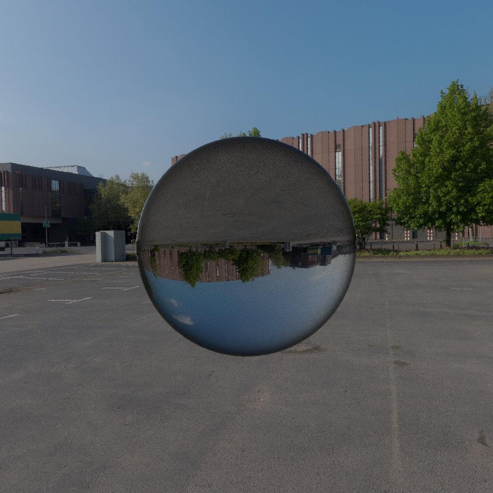
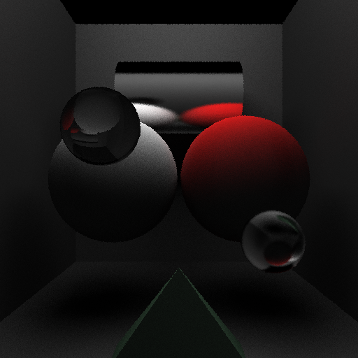

# Pathtracer

Pathtracer implemented in C++ for my Advanced Computer Graphics course.

Pathtracing is a rendering algorithm. For more information, see [the Wikipedia article](https://en.wikipedia.org/wiki/Path_tracing).

> *Contents:*
> - *[Features](#features)*
> - *[Examples](#examples)*
> - *[Dependencies](#dependencies)*
> - *[Assets](#assets)*
> - *[Resources](#resources)*

## Features

This project implements the following features:
- Reflection, refraction, shadows
- Optimization
  - [Bounding Volume Hierarchy](https://en.wikipedia.org/wiki/Bounding_volume_hierarchy) & median-split algorithm
  - Parallelization using OpenMP
- [Distributed ray-tracing](https://en.wikipedia.org/wiki/Distributed_ray_tracing)
  - Antialiasing
  - Glossy reflections
  - Translucency
  - Area lights & soft shadows
- UV Texture Mapping
- Lights: directional, point, area, sky dome
- BRDF light path sampling

## Examples

Highlighting Fresnel transmission:

## Dependencies
- [stb](https://github.com/nothings/stb) used for image loading and writing (see headers in `include/`)
- [OpenMP](https://www.openmp.org/specifications/) used for parallelization
- [Eigen](https://eigen.tuxfamily.org/index.php?title=Main_Page) used for linear algebra

## Assets
Example scenes, including those shown [above](#examples), can be found in `assets/inputs`.
### Texture Sources
I do not own the textures used in these renders. The HDRI is from [hdri-hub.com](https://www.hdri-hub.com/hdrishop/freesamples/freehdri/item/113-hdr-111-parking-space-free).

## Resources
Here are some resources that were useful to me during this project.
- [BRDF Crash Course](https://boksajak.github.io/files/CrashCourseBRDF.pdf)  by Jakub Boksansky
- [Physically Based Rendering | pbr-book.org](https://pbr-book.org/)
  - [Section 9.3](https://www.pbr-book.org/4ed/Reflection_Models/Specular_Reflection_and_Transmission): Specular Reflection and Transmission