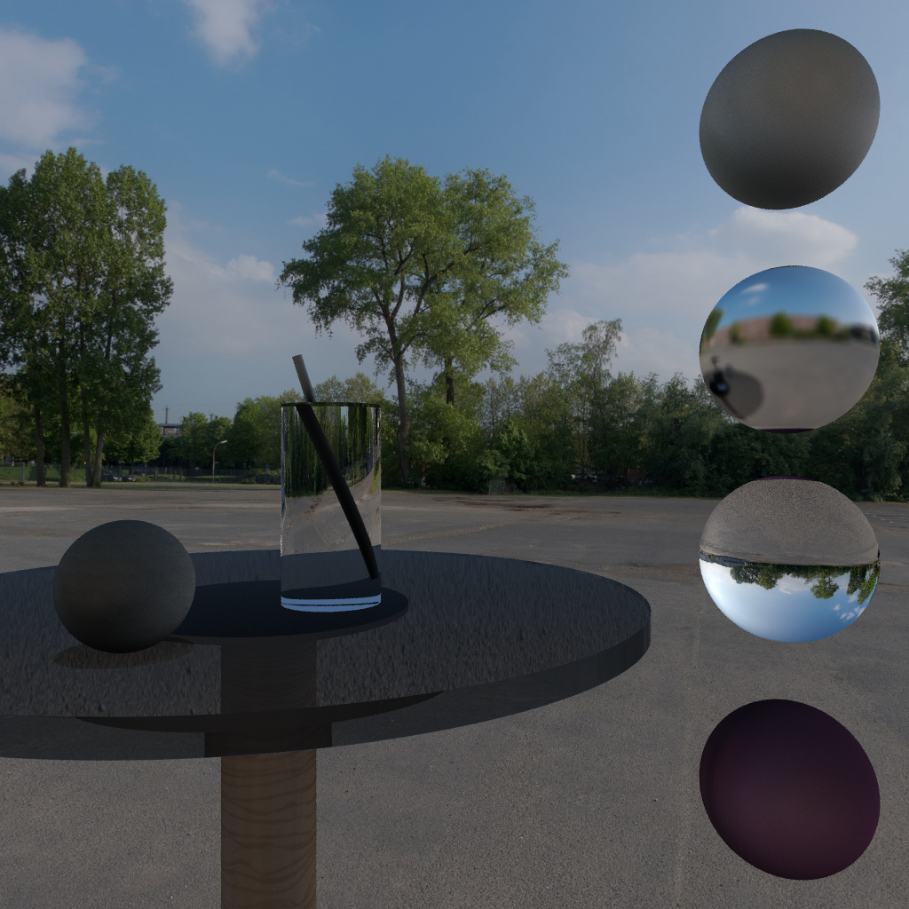

# Pathtracer

Pathtracer implemented in C++ for my Advanced Computer Graphics course.

Pathtracing is a rendering algorithm. For more information, see [the Wikipedia article](https://en.wikipedia.org/wiki/Path_tracing).

## Features

This project implements the following features:
- Reflection, refraction, shadows
- Optimization
  - [Bounding Volume Hierarchy](https://en.wikipedia.org/wiki/Bounding_volume_hierarchy) & median-split algorithm
  - Parallelization using OpenMP
- [Distributed ray-tracing](https://en.wikipedia.org/wiki/Distributed_ray_tracing)
  - Antialiasing
  - Glossy reflections
  - Translucency
  - Area lights & soft shadows
- UV Texture Mapping
- Lights: directional, point, area, sky dome
- BRDF light path sampling

## Examples

## Dependencies & Assets
### Dependencies
- [stb](https://github.com/nothings/stb) used for image loading and writing (see headers in `include/`)
- [OpenMP](https://www.openmp.org/specifications/) Used for parallelization
- [Eigen](https://eigen.tuxfamily.org/index.php?title=Main_Page) Used for linear algebra

### Texture Sources
I do not own the textures used in these renders. The HDRI is from [hdri-hub.com](https://www.hdri-hub.com/hdrishop/freesamples/freehdri/item/113-hdr-111-parking-space-free).
